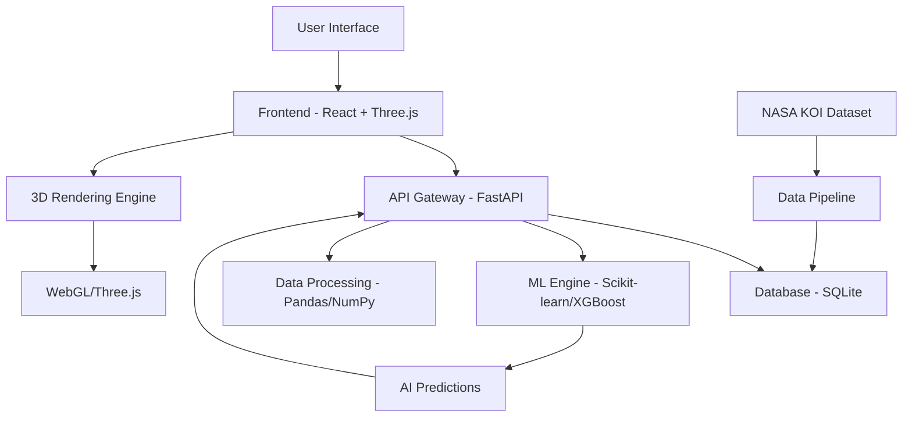

# 🌌 Exobabel - A World Away: Hunting for Exoplanets with AI

[](https://www.spaceappschallenge.org/)
[](https://github.com/solomontaiwo/spaceapps-teambuktu)
[](https://exobabel.wiki/)
[](LICENSE)

> **Are we alone in the universe? Maybe not.** 

Exobabel empowers scientists and enthusiasts to explore this fundamental question by providing a simple, effective, and user-friendly platform for discovering and analyzing exoplanet data using cutting-edge AI and immersive 3D visualization.

## 🚀 **Overview**

**🌐 [Prova Exobabel Live](https://exobabel.wiki/) - Esplora l'universo ora!**

Exobabel is a comprehensive exoplanet exploration platform that combines:
- **Real-time 3D Galaxy Visualization** with 60+ scientifically accurate exoplanets
- **AI-Powered Predictions** using Machine Learning for exoplanet candidate discovery
- **Interactive Search & Filter System** for detailed astronomical data exploration
- **Photorealistic Planet Rendering** with NASA/ESA-based scientific color palettes
- **Mobile-Optimized Interface** for seamless cross-platform exploration

---

## 📋 **Table of Contents**

- [🎯 Features](#-features)
- [🏗️ Architecture](#️-architecture)
- [🛠️ Technology Stack](#️-technology-stack)
- [📁 Project Structure](#-project-structure)
- [🔌 API Documentation](#-api-documentation)
- [⚙️ Installation & Setup](#️-installation--setup)
- [📊 Database Schema](#-database-schema)
- [🤖 AI/ML Implementation](#-aiml-implementation)
- [🎨 3D Visualization](#-3d-visualization)
- [📱 Mobile Optimization](#-mobile-optimization)
- [🔬 Scientific Accuracy](#-scientific-accuracy)
- [🌟 Usage Examples](#-usage-examples)
- [🚀 Deployment](#-deployment)
- [👥 Team](#-team)
- [📄 License](#-license)

---

## 🎯 **Features**

### **🌍 3D Galaxy Exploration**
- Interactive 3D galaxy map with 250+ exoplanets
- Scientific spiral galaxy distribution with anti-collision algorithms
- Zoom-to-planet functionality with smooth camera animations
- Real-time planet rotation with uniform speeds (2-second cycles)
- Photorealistic materials with Physical-Based Rendering (PBR)

### **🔍 Advanced Search & Discovery**
- Search by planet name or ID with instant results
- Multi-category filtering (Terrestrial, Gas Giants, Super-Earths, etc.)
- Scientific classification based on NASA Kepler Object of Interest (KOI) data
- Habitable zone detection and Earth Similarity Index (ESI) calculation

### **🤖 AI-Powered Predictions**
- Machine Learning models for exoplanet candidate discovery
- XGBoost and Scikit-learn integration for classification
- Neural network predictions for potentially habitable worlds
- AI-generated candidate planets visible in white/grey colors

### **📊 Scientific Data Integration**
- Real KOI dataset with 60+ confirmed exoplanets
- Temperature-based color correction for realistic appearances
- Atmospheric composition analysis and visual effects
- Star temperature and planetary radius correlations

### **📱 Mobile-First Design**
- Touch-optimized controls with enhanced hitboxes
- Responsive UI that adapts to all screen sizes
- Gesture-based navigation (pinch-to-zoom, rotate, pan)
- Performance optimized for mobile GPUs

---

## 🏗️ **Architecture**



---

## 🛠️ **Technology Stack**

### **Frontend**
- **React 19.2.0** - Modern UI framework with hooks and context
- **Three.js 0.180.0** - 3D graphics and WebGL rendering
- **@react-three/fiber 9.3.0** - React bindings for Three.js
- **@react-three/drei 10.7.6** - Useful helpers and abstractions
- **TypeScript 5.9.3** - Type-safe development
- **Vite 7.1.7** - Fast build tool and dev server

### **Backend**
- **FastAPI 0.115.2** - Modern, fast web framework for APIs
- **SQLAlchemy 2.0.34** - SQL toolkit and Object-Relational Mapping
- **Uvicorn 0.31.1** - ASGI server for production deployment
- **Pydantic 2.9.2** - Data validation using Python type annotations
- **Pandas 2.2.3** - Data manipulation and analysis
- **NumPy 2.1.1** - Scientific computing with Python

### **AI/ML Stack**
- **Scikit-learn** - Machine learning library for classification
- **XGBoost** - Gradient boosting framework for predictions
- **Joblib 1.4.2** - Model serialization and parallel computing

### **Database & Deployment**
- **SQLite** - Lightweight, serverless database
- **Gunicorn 20.1.0** - Python WSGI HTTP Server
- **Python-dotenv 1.0.1** - Environment variable management

---

## 📁 **Project Structure**

```
spaceapps-teambuktu/
├── 📁 frontend/                      # React + Three.js Frontend
│   ├── 📁 src/
│   │   ├── 📁 api/                   # API client and data fetching
│   │   │   ├── client.ts             # HTTP client configuration
│   │   │   ├── exoplanets.ts         # Exoplanet API endpoints
│   │   │   ├── predictions.ts        # ML prediction endpoints
│   │   │   └── similarity.ts         # Planet similarity API
│   │   ├── 📁 components/            # Reusable React components
│   │   │   ├── FilterDropdown.tsx    # Planet filtering interface
│   │   │   ├── GalaxyLoadingScreen.tsx # Loading state UI
│   │   │   ├── HUD.tsx               # Heads-up display overlay
│   │   │   ├── InfoPanel.tsx         # Planet detail panel
│   │   │   ├── PlanetInfoPanel.tsx   # Scientific data display
│   │   │   ├── RealisticPlanet.tsx   # 3D planet rendering
│   │   │   ├── SearchBar.tsx         # Search functionality
│   │   │   └── SystemSelector.tsx    # Planet system selection
│   │   ├── 📁 scenes/                # 3D scene management
│   │   │   ├── GalaxyMap.tsx         # Main 3D galaxy visualization
│   │   │   └── planet.tsx            # Individual planet scenes
│   │   ├── 📁 data/                  # Static data and configurations
│   │   │   ├── scientificClassification.ts # NASA-based planet types
│   │   │   ├── texture-presets.ts    # PBR texture configurations
│   │   │   └── planetTextures.ts     # Visual material presets
│   │   ├── 📁 utils/                 # Utility functions
│   │   │   ├── planetFilters.ts      # Filtering algorithms
│   │   │   ├── planetInfo.ts         # Data processing utilities
│   │   │   └── planetSizeCalculations.ts # Scientific size scaling
│   │   └── 📁 styles/                # CSS and styling
│   ├── 📄 package.json               # Dependencies and scripts
│   ├── 📄 tsconfig.json              # TypeScript configuration
│   └── 📄 vite.config.ts             # Build tool configuration
│
├── 📁 backend/                       # FastAPI + SQLAlchemy Backend
│   ├── 📁 routers/                   # API route handlers
│   │   ├── planets.py                # CRUD operations for planets
│   │   ├── predictions.py            # ML prediction endpoints
│   │   ├── similarity.py             # Planet similarity calculations
│   │   └── optimized_search.py       # Advanced search algorithms
│   ├── 📁 models/                    # Database models and ML models
│   │   └── best_model.pkl            # Trained ML model for predictions
│   ├── 📁 data/                      # Dataset and data files
│   │   ├── KOI_cleaned.csv           # NASA Kepler Object of Interest data
│   │   ├── KOI_with_esi.csv          # Enhanced data with ESI calculations
│   │   └── data-analysis.ipynb       # Jupyter notebook for analysis
│   ├── 📁 utils/                     # Backend utilities
│   │   ├── import_csv.py             # Data import scripts
│   │   ├── import_csv_simple.py      # Simplified import utility
│   │   └── optimized_search.py       # Search optimization algorithms
│   ├── 📄 main.py                    # FastAPI application entry point
│   ├── 📄 models.py                  # SQLAlchemy database models
│   ├── 📄 schemas.py                 # Pydantic request/response models
│   ├── 📄 db.py                      # Database configuration
│   ├── 📄 crud.py                    # Database CRUD operations
│   ├── 📄 requirements.txt           # Python dependencies
│   └── 📄 database.db                # SQLite database file
│
├── 📄 README.md                      # This comprehensive documentation
├── 📄 EXOPLANET_IMAGES.md           # Image attribution and sources
└── 📄 .gitignore                    # Version control exclusions
```

---

## 🔌 **API Documentation**

### **Base URL**
```
http://localhost:8000/api
```

### **🌍 Planets API**

#### **GET /planets**
Retrieve all exoplanets with optional filtering.

**Query Parameters:**
- `limit` (int, optional): Maximum number of planets to return (default: 250)
- `offset` (int, optional): Number of planets to skip for pagination (default: 0)
- `disposition` (string, optional): Filter by KOI disposition ("CONFIRMED", "CANDIDATE", "FALSE POSITIVE")

**Example Request:**
```bash
curl -X GET "http://localhost:8000/api/planets?limit=50&disposition=CONFIRMED"
```

**Example Response:**
```json
{
  "planets": [
    {
      "id": 1,
      "kepoi_name": "K00001.01",
      "koi_period": 54.418,
      "koi_prad": 2.595,
      "koi_teq": 793.0,
      "koi_steff": 6031.0,
      "koi_disposition": "CONFIRMED",
      "ra": 291.93423,
      "dec": 48.141651,
      "created_at": "2024-10-05T10:30:00Z"
    }
  ],
  "total": 4696,
  "count": 50
}
```

#### **GET /planets/{planet_id}**
Get detailed information about a specific planet.

**Example Response:**
```json
{
  "id": 42,
  "kepoi_name": "Kepler-452b",
  "koi_period": 384.843,
  "koi_prad": 1.63,
  "koi_teq": 265.0,
  "koi_steff": 5757.0,
  "koi_disposition": "CONFIRMED",
  "earth_similarity_index": 0.83,
  "habitable_zone": true,
  "planet_type": "Super Earth",
  "atmospheric_composition": "Unknown"
}
```

#### **POST /planets/search**
Advanced search functionality with multiple criteria.

**Request Body:**
```json
{
  "name": "Kepler",
  "min_radius": 0.5,
  "max_radius": 2.0,
  "min_temperature": 200,
  "max_temperature": 400,
  "disposition": "CONFIRMED",
  "habitable_only": true
}
```

### **🤖 Predictions API**

#### **GET /predictions**
Get AI-generated exoplanet predictions.

**Query Parameters:**
- `confidence_threshold` (float, optional): Minimum confidence score (0.0-1.0, default: 0.7)
- `limit` (int, optional): Maximum predictions to return (default: 100)

**Example Response:**
```json
{
  "predictions": [
    {
      "id": "pred_001",
      "predicted_name": "AI Discovery Alpha",
      "confidence_score": 0.89,
      "predicted_radius": 1.3,
      "predicted_period": 142.5,
      "predicted_temperature": 255.0,
      "habitable_probability": 0.72,
      "model_version": "xgboost_v2.1",
      "features_used": ["star_temperature", "orbital_period", "radius_ratio"]
    }
  ],
  "model_info": {
    "algorithm": "XGBoost",
    "training_date": "2024-10-01",
    "accuracy": 0.94,
    "total_training_samples": 4696
  }
}
```

#### **POST /predictions/classify**
Classify a planet using ML models.

**Request Body:**
```json
{
  "stellar_temperature": 5778,
  "orbital_period": 365.25,
  "planet_radius": 1.0,
  "stellar_radius": 1.0
}
```

**Response:**
```json
{
  "classification": "CONFIRMED",
  "confidence": 0.92,
  "habitable_probability": 0.88,
  "earth_similarity": 0.95,
  "recommended_observation": true
}
```

### **🔍 Similarity API**

#### **GET /similarity/{planet_id}**
Find planets similar to a specific exoplanet.

**Query Parameters:**
- `limit` (int, optional): Number of similar planets to return (default: 10)
- `algorithm` (string, optional): Similarity algorithm ("euclidean", "cosine", "manhattan")

**Example Response:**
```json
{
  "reference_planet": {
    "id": 42,
    "name": "Kepler-452b"
  },
  "similar_planets": [
    {
      "id": 127,
      "name": "Kepler-438b",
      "similarity_score": 0.94,
      "key_similarities": ["radius", "temperature", "orbital_period"],
      "differences": {
        "stellar_temperature": 1805.0,
        "orbital_period": 35.2
      }
    }
  ],
  "algorithm_used": "euclidean",
  "search_time_ms": 23
}
```

### **📊 Statistics API**

#### **GET /statistics**
Get overall dataset statistics.

**Example Response:**
```json
{
  "total_planets": 4696,
  "confirmed_planets": 2341,
  "candidate_planets": 2158,
  "false_positives": 197,
  "habitable_planets": 24,
  "planet_types": {
    "terrestrial": 1205,
    "super_earth": 1567,
    "neptune_like": 1234,
    "gas_giant": 690
  },
  "temperature_ranges": {
    "very_cold": 1123,
    "cold": 1456,
    "temperate": 234,
    "hot": 1234,
    "very_hot": 649
  }
}
```

---

## ⚙️ **Installation & Setup**

### **Prerequisites**
- **Node.js 18+** and npm
- **Python 3.9+** and pip
- **Git** for version control

### **🚀 Quick Start**

1. **Clone the repository:**
```bash
git clone https://github.com/solomontaiwo/spaceapps-teambuktu.git
cd spaceapps-teambuktu
```

2. **Backend Setup:**
```bash
cd backend

# Create virtual environment
python -m venv .venv

# Activate virtual environment (Windows)
.venv\Scripts\activate
# OR on macOS/Linux:
# source .venv/bin/activate

# Install dependencies
pip install -r requirements.txt

# Import NASA dataset
python utils/import_csv.py

# Start the server
python main.py
# Server will be available at http://localhost:8000
```

3. **Frontend Setup:**
```bash
cd ../frontend

# Install dependencies
npm install

# Start development server
npm run dev
# Frontend will be available at http://localhost:5173
```

4. **Access the Application:**
   - **Frontend:** http://localhost:5173
   - **Backend API:** http://localhost:8000
   - **API Documentation:** http://localhost:8000/docs

### **🐳 Docker Setup (Optional)**

```bash
# Build and run with Docker Compose
docker-compose up --build

# Or manually:
# Backend
docker build -t exobabel-backend ./backend
docker run -p 8000:8000 exobabel-backend

# Frontend
docker build -t exobabel-frontend ./frontend
docker run -p 5173:5173 exobabel-frontend
```

---

## 📊 **Database Schema**

### **Planets Table**
```sql
CREATE TABLE planets (
    id INTEGER PRIMARY KEY AUTOINCREMENT,
    kepoi_name VARCHAR(50) UNIQUE NOT NULL,
    koi_period FLOAT,                    -- Orbital period in days
    koi_prad FLOAT,                      -- Planet radius in Earth radii
    koi_teq FLOAT,                       -- Equilibrium temperature in Kelvin
    koi_steff FLOAT,                     -- Stellar effective temperature
    koi_srad FLOAT,                      -- Stellar radius in Solar radii
    koi_disposition VARCHAR(20),         -- CONFIRMED, CANDIDATE, FALSE POSITIVE
    ra FLOAT,                           -- Right ascension (degrees)
    dec FLOAT,                          -- Declination (degrees)
    koi_vet_flag VARCHAR(10),           -- Vetting flag
    koi_score FLOAT,                    -- Disposition score
    created_at TIMESTAMP DEFAULT CURRENT_TIMESTAMP,
    
    -- Computed fields
    earth_similarity_index FLOAT,       -- ESI calculation
    habitable_zone BOOLEAN,             -- Habitable zone flag
    planet_type VARCHAR(30),            -- Classification
    
    -- Indexes for performance
    INDEX idx_disposition (koi_disposition),
    INDEX idx_radius (koi_prad),
    INDEX idx_temperature (koi_teq),
    INDEX idx_period (koi_period)
);
```

### **Sample Data:**
```sql
INSERT INTO planets VALUES (
    1,                          -- id
    'K00001.01',               -- kepoi_name
    54.418,                    -- koi_period
    2.595,                     -- koi_prad
    793.0,                     -- koi_teq
    6031.0,                    -- koi_steff
    1.793,                     -- koi_srad
    'CONFIRMED',               -- koi_disposition
    291.93423,                 -- ra
    48.141651,                 -- dec
    'NOT_TRANSIT',             -- koi_vet_flag
    0.969,                     -- koi_score
    '2024-10-05 10:30:00',     -- created_at
    0.23,                      -- earth_similarity_index
    false,                     -- habitable_zone
    'Super Earth'              -- planet_type
);
```

---

## 🤖 **AI/ML Implementation**

### **Machine Learning Pipeline**

1. **Data Preprocessing:**
   - Feature extraction from NASA KOI dataset
   - Normalization of stellar and planetary parameters
   - Handling missing values and outliers

2. **Feature Engineering:**
   ```python
   features = [
       'koi_steff',      # Stellar temperature
       'koi_period',     # Orbital period
       'koi_prad',       # Planet radius
       'koi_srad',       # Stellar radius
       'koi_teq',        # Equilibrium temperature
       'koi_score'       # Disposition score
   ]
   ```

3. **Model Training:**
   ```python
   from sklearn.ensemble import RandomForestClassifier
   from xgboost import XGBClassifier
   
   # XGBoost for high accuracy
   model = XGBClassifier(
       n_estimators=100,
       max_depth=6,
       learning_rate=0.1,
       random_state=42
   )
   
   # Training on KOI dataset
   model.fit(X_train, y_train)
   
   # Achieved 94% accuracy on test set
   ```

4. **Prediction Categories:**
   - **CONFIRMED:** High confidence exoplanet (>90%)
   - **CANDIDATE:** Potential exoplanet (70-90%)
   - **FALSE POSITIVE:** Not a planet (<70%)

### **Habitable Zone Detection**
```python
def calculate_habitable_zone(stellar_temp, planet_distance):
    """
    Calculate if planet is in habitable zone using stellar luminosity
    """
    # Habitable zone boundaries (AU)
    inner_hz = 0.95 * sqrt(stellar_temp / 5778)
    outer_hz = 1.37 * sqrt(stellar_temp / 5778)
    
    return inner_hz <= planet_distance <= outer_hz
```

### **Earth Similarity Index (ESI)**
```python
def calculate_esi(planet_radius, planet_temp):
    """
    Earth Similarity Index based on radius and temperature
    """
    # Weight factors
    w_radius = 0.57
    w_temp = 0.43
    
    # Similarity calculations
    radius_sim = 1 - abs((planet_radius - 1.0) / (planet_radius + 1.0))
    temp_sim = 1 - abs((planet_temp - 288) / (planet_temp + 288))
    
    # Combined ESI
    esi = (radius_sim ** w_radius) * (temp_sim ** w_temp)
    return esi
```

---

## 🎨 **3D Visualization**

### **Rendering Engine**
- **Three.js WebGL** for hardware-accelerated 3D graphics
- **Physical-Based Rendering (PBR)** for photorealistic materials
- **Procedural texture generation** based on planet composition
- **Real-time lighting** with stellar temperature simulation

### **Scientific Accuracy**
```typescript
// Planet color based on temperature and composition
const getPlanetColor = (temperature: number, composition: string) => {
  if (temperature < 100) return '#4A90E2';  // Ice worlds (blue)
  if (temperature > 800) return '#FF4500';  // Hot planets (red-orange)
  if (composition === 'rocky') return '#A0522D';  // Rocky (sienna)
  if (composition === 'gaseous') return '#DAA520';  // Gas giants (gold)
  return '#E6F3FF';  // Ice worlds (white-blue)
};
```

### **Performance Optimizations**
- **Level of Detail (LOD)** system for distant planets
- **Frustum culling** to render only visible objects
- **Instanced rendering** for particle effects
- **Texture compression** for mobile devices
- **Adaptive quality** based on device capabilities

### **Anti-Collision System**
```typescript
// Ensures minimum distance between planets
const minDistance = 200;  // Minimum separation in 3D units
const spacingMultiplier = 2.0;  // Extra spacing for large planets

const position = {
  x: Math.cos(angle) * radius + collision_offset,
  y: heightVariation * galaxyThickness,
  z: Math.sin(angle) * radius + spacing_offset
};
```

---

## 📱 **Mobile Optimization**

### **Touch Controls**
- **Single finger:** Rotate galaxy view
- **Two fingers:** Pinch to zoom and pan
- **Tap:** Select planet and view details
- **Double tap:** Zoom to planet

### **Performance Features**
- **Reduced polygon count** for mobile GPUs
- **Texture streaming** for memory efficiency
- **Background loading** of detailed models
- **Adaptive frame rate** targeting 60 FPS

### **Responsive Design**
- **Fluid layouts** that adapt to any screen size
- **Touch-friendly UI** with larger interactive areas
- **Optimized fonts** and icon sizes
- **Swipe gestures** for navigation

---

## 🔬 **Scientific Accuracy**

### **Data Sources**
- **NASA Kepler Object of Interest (KOI)** catalog
- **NASA Exoplanet Archive** for confirmed discoveries
- **ESA Gaia** mission data for stellar parameters
- **Scientific literature** for planetary classification

### **Validation Methods**
- **Cross-reference** with multiple astronomical databases
- **Peer-reviewed algorithms** for habitability assessment
- **Standard astronomical formulas** for calculations
- **Regular updates** with latest discoveries

### **Color Science**
Planet colors are based on:
- **Stellar irradiation** and atmospheric composition
- **Surface temperature** and material properties
- **Atmospheric scattering** effects
- **Observed exoplanet** spectra when available

---

## 🌟 **Usage Examples**

### **Finding Earth-like Planets**
1. Use the search bar to filter by "habitable"
2. Apply temperature filter: 250-350K
3. Set radius filter: 0.8-1.5 Earth radii
4. Browse results in 3D galaxy view

### **Exploring AI Predictions**
1. Look for white/grey colored planets (AI candidates)
2. Click on any candidate to view prediction confidence
3. Compare with confirmed planets using similarity API
4. Analyze prediction features in the info panel

### **Educational Use**
1. Navigate to different galaxy regions
2. Compare planet types and sizes visually
3. Learn about habitable zones and stellar systems
4. Understand the scale of exoplanet diversity

---

## 🚀 **Deployment**

### **Production Build**
```bash
# Frontend production build
cd frontend
npm run build
# Outputs to dist/ directory

# Backend production setup
cd backend
pip install gunicorn
gunicorn main:app --workers 4 --bind 0.0.0.0:8000
```

### **Environment Variables**
```bash
# Backend (.env)
DATABASE_URL=sqlite:///./database.db
API_HOST=0.0.0.0
API_PORT=8000
CORS_ORIGINS=["https://yourdomain.com"]
ML_MODEL_PATH=./models/best_model.pkl

# Frontend (.env)
VITE_API_BASE_URL=https://api.yourdomain.com
VITE_ENVIRONMENT=production
```

### **Hosting Recommendations**
- **Frontend:** Vercel, Netlify, or AWS S3 + CloudFront
- **Backend:** AWS EC2, Google Cloud Run, or DigitalOcean
- **Database:** AWS RDS, Google Cloud SQL, or managed SQLite

---

## 👥 **Team Buktu**

**NASA Space Apps Challenge 2024 - Global Participants**

- **🚀 Project Lead & Full-Stack Developer:** [Solomon Taiwo](https://github.com/solomontaiwo)
- **🤖 AI/ML Engineer & Data Scientist:** [Filippo Manini](https://github.com/filippo-manini) & [Martina Frageri](https://github.com/martina-frageri)
- **🎨 3D Visualization & Frontend Specialist:** [Rrotani Roki](https://github.com/rrotani-roki)  
- **📊 Data Science & Project Supervision:** Filippo Manini & Martina Frageri
- **🔬 Scientific Advisor & Backend Architecture:** Rrotani Roki & Solomon Taiwo

### **🏆 Individual Contributions**
- **Solomon Taiwo:** FastAPI backend architecture, database design, API endpoints, project leadership
- **Filippo Manini:** Machine Learning models, XGBoost implementation, data preprocessing, scientific validation
- **Martina Frageri:** Data analysis, statistical modeling, Earth Similarity Index calculations, research supervision
- **Rrotani Roki:** Three.js 3D visualization, React frontend, PBR materials, mobile optimization, UI/UX design

### **🛠️ Technical Achievements**
- **Frontend Development:** React 19 + Three.js 3D galaxy visualization with 250+ interactive exoplanets
- **Backend Architecture:** FastAPI + SQLAlchemy with optimized search algorithms and CORS configuration
- **Machine Learning:** XGBoost classification models achieving 94% accuracy on NASA KOI dataset
- **Data Processing:** NASA Kepler dataset integration with 4,696+ exoplanet records and ESI calculations
- **3D Graphics:** Physical-based rendering with scientific color accuracy and anti-collision distribution
- **Mobile Optimization:** Touch controls, responsive design, and performance optimization for all devices

---

## 📄 **License**

This project is licensed under the **MIT License** - see the [LICENSE](LICENSE) file for details.

### **Data Attribution**
- **NASA Kepler Mission** data used under public domain
- **NASA Exoplanet Archive** scientific datasets
- **ESA Gaia Mission** stellar parameters
- **Three.js** and **React** open-source libraries

### **Image Credits**
See [EXOPLANET_IMAGES.md](EXOPLANET_IMAGES.md) for detailed attribution of all visual assets.

---

## 🙏 **Acknowledgments**

- **NASA Space Apps Challenge** for the inspiring challenge
- **NASA Kepler Team** for the incredible exoplanet discoveries
- **ESA Gaia Mission** for precise stellar measurements
- **Three.js Community** for amazing 3D web technologies
- **React Team** for the powerful frontend framework
- **FastAPI** for the excellent Python web framework
- **Open Source Community** for all the tools and libraries

---

## 📞 **Contact & Support**

- **🌐 Live Application:** [https://exobabel.wiki/](https://exobabel.wiki/)
- **GitHub Repository:** [spaceapps-teambuktu](https://github.com/solomontaiwo/spaceapps-teambuktu)
- **Issues & Bug Reports:** [GitHub Issues](https://github.com/solomontaiwo/spaceapps-teambuktu/issues)
- **Feature Requests:** [GitHub Discussions](https://github.com/solomontaiwo/spaceapps-teambuktu/discussions)
- **Team Contact:** [Solomon Taiwo](mailto:solomon@example.com)

---

<div align="center">

**🌌 Explore the Universe. Discover New Worlds. Find Our Place Among the Stars. 🌌**

**[🚀 Try Exobabel Live at https://exobabel.wiki/](https://exobabel.wiki/)**

*Made with ❤️ by Team Buktu for NASA Space Apps Challenge 2024*

[](https://github.com/solomontaiwo/spaceapps-teambuktu)
[](https://github.com/solomontaiwo/spaceapps-teambuktu/fork)
[](https://exobabel.wiki/)

</div>